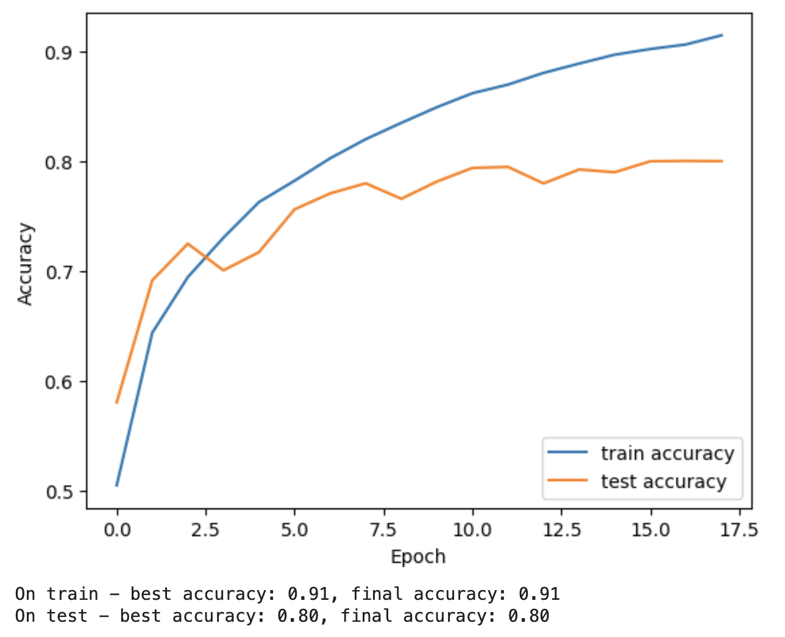

# CIFAR-10 Image Classification with PyTorch in Jupyter Notebook

This repository contains a Jupyter Notebook implementation of a convolutional neural network (CNN) for image classification on the CIFAR-10 dataset using PyTorch. The CIFAR-10 dataset consists of 60,000 32x32 color images in 10 classes, with 6,000 images per class. The dataset is divided into 50,000 training images and 10,000 testing images.

## Running in Google Colab

To run this notebook efficiently, it is recommended to use Google Colab with a GPU, especially a T4 GPU for faster computation. Follow these steps to run the notebook in Google Colab:

1. Open the notebook `CIFAR_10_Image_Classification.ipynb` in Google Colab.

2. Ensure that GPU acceleration is enabled in Colab:

   - Go to `Runtime` -> `Change runtime type`.
   - Select `GPU` from the `Hardware accelerator` dropdown.
   - Click `Save`.

3. Run the notebook cells one by one or all at once to train and evaluate the model.

## Contents

- Import Libraries
- Set Device
- A Brief View on Data
- Define Batch Size
- Define Model
- Create Model
- Choose a Loss Function
- Choose an Optimizer
- Training Model
- Evaluation

## Dependencies

- PyTorch
- torchvision
- tqdm
- matplotlib

## Accuracy

